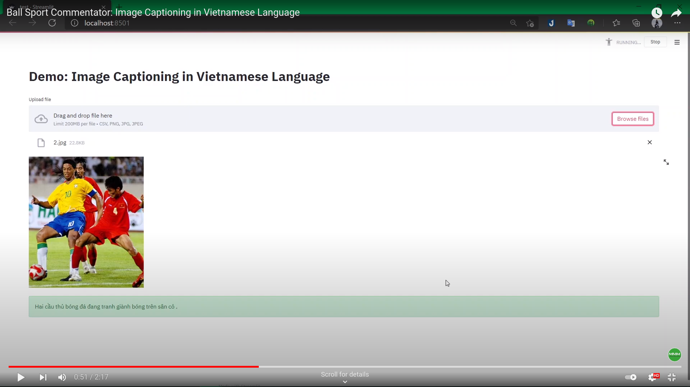

# cv-nlp-end-term

## Project description

### Pipeline


### Applications

- Speech synthesis to help the blind people
- Automatically generate image description on e-commerce platforms
- Video description. Used for searching video

## The notebooks

The notebooks for preprocessing data, training, evaluating the experiments are in [`strategy-1` branch](https://github.com/congphase/img-captioning-in-vietnamese/tree/strategy-1/notebooks)

## More details
Read our thesis [here](docs/Final_report.pdf)

## The demo

### Idea

Simulate a sport event where the crowd is cheering, and the commentator is delivering his speech based on the situation of the match.

### Watch it
[Demo video](https://youtu.be/jcMWzUln6Rs)

### The model

- Resnet152 + LSTM, without Attention
- Downloads:
  - [encoder](https://drive.google.com/file/d/1mrRQaHuPRClyW_TklpVmnlu4jb-_J5xX/view?usp=sharing)
  - [decoder](https://drive.google.com/file/d/12e-P6eQfmm_tU05f8-a-xF-DIvEKcBso/view?usp=sharing)

### Reproduce the demo

#### Crete anaconda environment

```
conda env create -f environment.yml
```

#### Run

```
cd cv-nlp-end-term
streamlit run test.py
```
